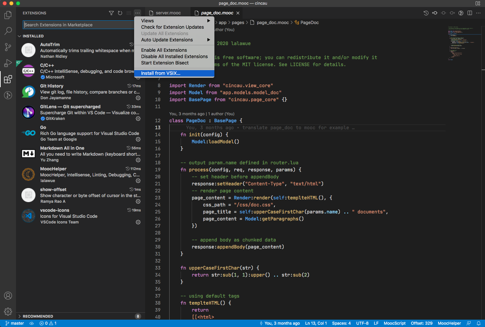

[![MIT licensed][1]][2]


[1]: https://img.shields.io/badge/license-MIT-blue.svg
[2]: LICENSE

- [MoonCake](#mooncake)
- [Features](#features)
- [Examples](#examples)
  - [class / struct / extension](#class--struct--extension)
  - [guard / continue / switch / defer](#guard--continue--switch--defer)
  - [import / closure / string expression](#import--closure--string-expression)
- [More Depth](#more-depth)
- [Install](#install)
- [Running](#running)
- [Test](#test)
- [Editor with LSP Support](#editor-with-lsp-support)
- [Projects using MoonCake](#projects-using-mooncake)

## MoonCake

MoonCake was a Swift like programming language that compiles into Lua, runs on Lua 5.1 and above, including LuaJIT.

## Features

with differences from Lua

- always declare variable as `local`, unless using `export` keyword
- using `{` and `}` instead of keyword `do`, `then`, `end` to seperate code block
- support `guard` keyword, which must transfer control at scope end
- support `switch` keyword, you can `case` a lot of conditions at a time
- support `continue` keyword, implemented by `goto`, available in Lua 5.2 and LuaJIT
- support `defer` keyword in function scope, including anonymous function
- support `class` and `struct` for simpler Object Oriented programming
- support `extension` keyword for extend class/struct
- support `import` keyword for simpler `require` a lot of sub modules
- support convenient anonymous function form `{ in }` likes in Swift
- support expression in string like `print("5 + 3 = \(5 + 3)")`

## Examples

### class / struct / extension

```lua
class Animal {

    foot = 2

    wing = 0

    fn init() {
    }

    fn canFly() {
        return self.wing > 0
    }
}

class Bird : Animal {

    fn init(wing) {
        self.foot = 2
        self.wing = wing or 2
    }
}

struct Songster {

    tune = 'do'

    fn canSing() {
        return true
    }
}

extension Bird: Songster {

    feather = true

    fn canRun() {
        return self.foot >= 4
    }
}

b = Bird()
print(b.foot) -- 2
print(b.wing) -- 2
print(b.tune) -- do
print(b.feather) -- true
print(b:canRun()) -- false
print(b:canFly()) -- true
print(b:canSing()) -- true
```

### guard / continue / switch / defer

```lua
-- guard, continue, switch
do {
    for i, v in ipairs(tbl) {

        guard i > 1 else {
            continue
        }
        switch v {
            case 'B':
                v = 'case ' .. v
            default:
                v = 'default ' .. v
        }
        print(v)
    }
}
-- print 'case B'
-- print 'default C'

-- defer keyword
do {
    fn aboutDeferKeyword() {
        defer {
            print("defer block")
        }
        print("fn block")
        return "return value"
    }
    print(aboutDeferKeyword())
}
-- print 'fn block'
-- print 'defer block'
-- print 'return value'
```

### import / closure / string expression

```lua
import Utils from "moocscript.utils" -- import Utils
import sort, concat from table {} -- import table.sort, table.concat

tbl = { "A", "B", "C" }

-- closure, or anonymous function
do {
    sort(tbl, { a, b in
        return a > b
    })
    print(concat(tbl))
}
-- print 'CBA'

-- string expression
print("Hello, world \(600 + 60 + 6) !")
-- Hello, world 666 !
```

## More Depth

recommand install and running first, or get more straight expressions from 'examples/' dir, before dig into detials about the language and usage

- [The Language](docs/language.md)
- [CommandLine Usage](docs/cmdline.md)
- [Library Interface](docs/library.md)

## Install

recommend install from [LuaRocks](https://luarocks.org/)

```sh
$ luarocks install mooncake
```

or edit Makefile for a custom install

```sh
$ vi Makefile
$ make install
```

or just run as playground in project root dir

```sh
$ export LUA_PATH=./?.lua
$ ./bin/moocscript
```

with requirement

- [Lua](https://www.lua.org/) >= 5.1 **OR** [LuaJIT](https://luajit.org/) >= 2.0
- [LuaFileSystem](http://keplerproject.github.io/luafilesystem/) >= 1.5 (only if you need project building, bundling)


## Running

check install first

```sh
$ moocscript -v
moocscript v0.7.20220501, Lua 5.4
```

then enter REPL without an editor

```sh
$ ./bin/moocscript -i
moocscript v0.7.20221006, Lua 5.4
> export * -- default global variable
> class Person {
	name = ''
	fn init(name) {
		self.name = name
	}
	fn intro() {
		return "My name is \(self.name)"
	}
}
> petter = Person("Petter")
> print(petter:intro())
My name is Petter
```

you can run .lua or .mooc source directly, support options below

```
$ moocscript
Usage: [OPTIONS] SOURCE.[lua|mooc]
        '' load SOURCE and run
        -h print help
        -a print AST
        -s print Lua code
        -i enter REPL
        -p generate Lua code with project config
        -v version
```

project config example is `examples/proj/proj_config.mooc`, you can see how to config it through [CommandLine Usage](docs/cmdline.md).

## Test

using [busted](https://olivinelabs.com/busted/), running from project dir, first `make test` before `busted`,
for generating package.path including current `moocscript/` dir.

```sh
$ luarocks install busted
$ make test
●●●●●●●●●●●●●●●●●●...
302 successes / 0 failures / 0 errors / 0 pending : 0.29858 seconds
```

you can install [LuaCov](https://keplerproject.github.io/luacov/) to get code coverage report

```sh
$ luarocks install luacov
$ make test
$ busted -c
$ luacov
$ cat luacov.report.out | grep '^moocscript/'
...
moocscript/class.lua                                                    60   10     85.71%
moocscript/compile.lua                                                  907  39     95.88%
moocscript/core.lua                                                     68   11     86.08%
moocscript/parser.lua                                                   1127 22     98.09%
moocscript/utils.lua                                                    121  14     89.63%
...
```

## Editor with LSP Support

[MoocHelper](https://github.com/lalawue/MoocHelper) is a High-performance MoonCake/Lua plugin, Language Server Protocol for MoonCake/Lua, modified from [LuaHelper](https://github.com/Tencent/LuaHelper).

you can create your own .vsix package through `vsce package`, or you can download a pre-build one in [releases](https://github.com/lalawue/MoocHelper/releases/), or in [gitee mirror](https://gitee.com/lalawue/MoocHelper/releases/).




## Projects using MoonCake

- [Lua-ORM](https://github.com/lalawue/Lua4DaysORM)
- [cincau](https://github.com/lalawue/cincau)
- [rpc_framework](https://github.com/lalawue/rpc_framework)
