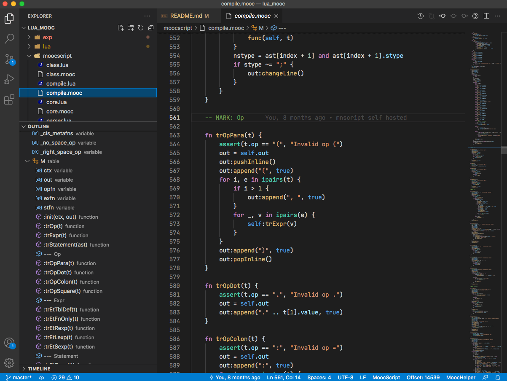

[![MIT licensed][1]][2]


[1]: https://img.shields.io/badge/license-MIT-blue.svg
[2]: LICENSE

## MoonCake

MoonCake was a Swift like programming language that compiles into Lua, runs on Lua 5.1 and above, including LuaJIT.

recommand install and running first, or get more straight expressions from 'examples/' dir, before dig into detials
 about the language and usage

- [The Language](docs/language.md)
- [CommandLine Usage](docs/cmdline.md)
- [Library Interface](docs/library.md)

## Features

with differences from Lua

- variable default local scope
- support guard keyword
- support switch keyword
- support continue keyword
- support defer keyword in function scope
- support create class / struct
- support extension class / struct
- support import keyword
- support anonymous function form '{ in }' likes in Swift

## Examples

### class/extension

```lua
class Animal {

    foot = 4

    wing = 0

    fn init() {
    }

    fn canFly() {
        return self.wing > 0
    }
}

class Bird : Animal {

    fn init(wing) {
        self.foot = 2
        self.wing = wing or 2
    }
}

extension Bird {

    fn canRun() {
        return false
    }
}

b = Bird()
print(b:canFly()) -- true
print(b:canRun()) -- false
```

### guard/continue/switch/defer

```lua

import CJson from "cjson" -- import CJson
import sort, concat from table {} -- import table.sort, table.concat

tbl = { "A", "B", "C" }

-- guard, continue, switch
do {
    for i, v in ipairs(tbl) {
        guard i > 1 else {
            continue
        }
        switch v {
            case 'B':
                v = 'case ' .. v
            default:
                v = 'default ' .. v
        }
        print(v)
    }
}
-- print 'case B'
-- print 'default C'

-- anonymous function
do {
    sort(tbl, { a, b in
        return a > b
    })
    print(concat(tbl))
}
-- print 'CBA'

-- defer keyword
do {
    fn aboutDeferKeyword() {
        defer {
            print("defer block")
        }
        print("fn block")
        return "return value"
    }
    print(aboutDeferKeyword())
}
-- print 'fn block'
-- print 'defer block'
-- print 'return value'
```

## Install

recommend install from [LuaRocks](https://luarocks.org/)

```sh
$ luarocks install mooncake
```

or edit Makefile for a custom install

```sh
$ vi Makefile
$ make install
```

or just run as playground in project root dir, but need [LPeg](http://www.inf.puc-rio.br/~roberto/lpeg/) installed, and in Lua's package.cpath

```sh
$ ./bin/moocscript
```

with requirement

- [Lua](https://www.lua.org/) >= 5.1 **OR** [LuaJIT](https://luajit.org/) >= 2.0
- [LPeg](http://www.inf.puc-rio.br/~roberto/lpeg/) >= 1.0.2
- [LuaFileSystem](http://keplerproject.github.io/luafilesystem/) >= 1.5 ( only if you need project compile )

## Running

check install first

```sh
$ moocscript -v
moocscript v0.3.20210612, Lua 5.3, LPeg 1.0.2
```

you can run .lua or .mooc source directly, support options below

```
$ moocscript
Usage: [OPTIONS] SOURCE.[lua|mooc]
        '' load SOURCE and run
        -h print help
        -a print AST
        -s print Lua code
        -p generate Lua code with project config
        -v version
```

project config example is examples/proj/proj_config.mooc

## Test

using [busted](https://olivinelabs.com/busted/), running from project dir

```sh
$ luarocks install busted
$ busted
●●●●●●●●●●●●●●●●●●...
209 successes / 0 failures / 0 errors / 0 pending : 0.16972 seconds
```

you can install [LuaCov](https://keplerproject.github.io/luacov/) to get code coverage report

```sh
$ luarocks install luacov
$ busted -c
$ luacov
$ cat luacov.report.out | grep 'moocscript/'
...
moocscript/class.lua                                              30   2      93.75%
moocscript/compile.lua                                            1109 14     98.75%
moocscript/core.lua                                               86   2      97.73%
moocscript/parser.lua                                             241  3      98.77%
moocscript/utils.lua                                              110  4      96.49%
...
```

## Editor with LSP Support

[MoocHelper](https://github.com/lalawue/MoocHelper) is a High-performance MoonCake/Lua plugin, Language Server Protocol for MoonCake/Lua, modified from [LuaHelper](https://github.com/Tencent/LuaHelper).

you can create your own .vsix package through `vsce package`, or you can download a pre-build one in [releases](https://github.com/lalawue/MoocHelper/releases/), or in [gitee mirror](https://gitee.com/lalawue/MoocHelper/releases/).




## Projects using MoonCake

- [rpc_framework](https://github.com/lalawue/rpc_framework)
- [cincau](https://github.com/lalawue/cincau)
